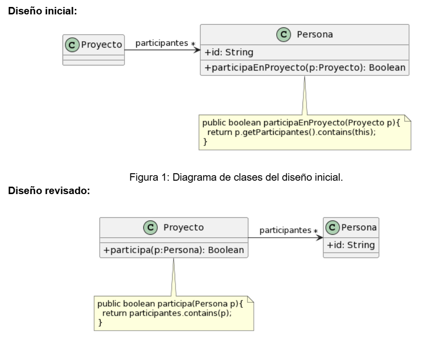

# Algo huele mal

## 1.1 Protocolo de Cliente
La clase Cliente tiene el siguiente protocolo. ¿Cómo puede mejorarlo? 


```java
* Retorna el límite de crédito del cliente
*/
public double lmtCrdt() {...

/** 
* Retorna el monto facturado al cliente desde la fecha f1 a la fecha f2
*/
protected double mtFcE(LocalDate f1, LocalDate f2) {...

/** 
* Retorna el monto cobrado al cliente desde la fecha f1 a la fecha f2
*/
private double mtCbE(LocalDate f1, LocalDate f2) {...
```

**Respuesta:**

*Code Smells*
- Los nombres de los métodos son pocos descriptivos, así mismo los nombres de las variables deben indicar su **rol** y los nombres de los **métodos** su intención.

Podrías reescribirse de la siguiente manera:

```java

public double limiteDeCredito(){...}

public double montoFacturado(LocalDate fechaInicio, LocalDate fechaFin){...}

public double montoCobrado(LocalDate fechaInicio, LocalDate fechaFin){...}
```

## 1.2 Participación en Proyectos

Al revisar el siguiente diseño inicial (Figura 1), se decidió realizar un cambio para evitar lo que se consideraba un mal olor. El diseño modificado se muestra en la Figura 2. Indique qué tipo de cambio se realizó y si lo considera apropiado. Justifique su respuesta.



*Code Smells*
- Feature Envy
- Data Class

Los cambios realizados los considero apropiados porque la clase Persona tiene envidia de atributos respecto a Proyecto, ya que el acceso a los participantes originalmente le corresponde a Proyecto. 
También proyecto sin este cambio sería solamente una Data Class.

## 1.3 Cálculos
Analice el código que se muestra a continuación. Indique qué code smells encuentra y cómo pueden corregirse.						

```java

public void imprimirValores() {
	int totalEdades = 0;
	double promedioEdades = 0;
	double totalSalarios = 0;
	
	for (Empleado empleado : personal) {
		totalEdades = totalEdades + empleado.getEdad();
		totalSalarios = totalSalarios + empleado.getSalario();
	}
	promedioEdades = totalEdades / personal.size();
		
	String message = String.format("El promedio de las edades es %s y el total de salarios es %s", promedioEdades, totalSalarios);
	
	System.out.println(message);
}


```

*Code Smells*
- Los nombres son pocos descriptivos. Se podría cambiar el nombre de 'imprimirValores' a 'imprimirValoresPromedioEdadesYTotalSalarios'. Aunque seguiría quedando excesivamente largo.
- Otro mal olor es el de *Large Method*, podría reescribirse de la siguiente manera:

```java
public void imprimirValores(){
    return system.out.println("Promedio de edades: " + this.calcularPromedioEdades() + " | Total salarios: " + this.calcularTotalSalarios());
}

private int sumarEdades(){
    int sumaEdades = 0;
    for(Empleado empleado : this.personal){
        sumaEdades += empleado.getEdad();
    }
    return sumaEdades;
}

private double calcularPromedioEdades(){
    return (this.sumarEdades() / this.personal.size());
}

private double calcularTotalSalarios(){
    double totalSalarios = 0;
    for(Empleado empleado : this.personal){
        totalSalarios += empleado.getSalario();
    }
    return totalSalarios;
}

```