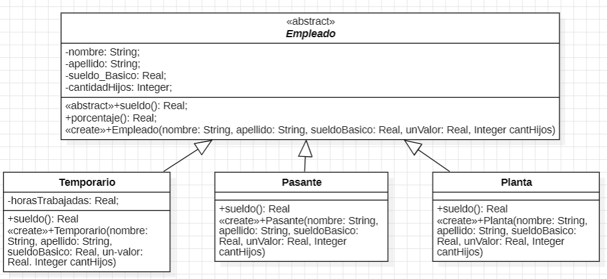

# GRETA huele mal
### Pasos a seguir 
- 1) Detectar y nombrar los malos olores.
- 2) Extraer el código donde se encuentra el "code smells".
- 3) Determinar los refactoring que se van a utilizar.
- 4) Desarrollar el UML con la soución final.
- 5) Expongo el código correjido, con el refactoring aplicado.
- 6) Vuelvo al paso uno. Sino encuentro más code smells termino.

## 1.1 Protocolo de Juego
La clase Juego tiene el siguiente protocolo. ¿Cómo puede mejorarlo? 

### 1. Code smells encontrados
- Envidio de atributos
- los atributos son públicos
- Nombre de los métodos poco descriptivos

### 2. extraer código con el code smells

```java 
public class Juego {
    public void incrementar(Jugador j) {  //nombre poco descriptivo
        j.puntuacion = j.puntuacion + 100;
    }
    public void decrementar(Jugador j) { 
        j.puntuacion = j.puntuacion - 50; //Envidio de atributos 
    }
}
public class Jugador {
    public String nombre; //los atributos son públicos
    public String apellido;
    public int puntuacion = 0;
}
```
### 3. Determinar los refactoring a utizizar
-Rename method
-Move method

### 4. Desarrollo del UML con el nuevo código



### 5 Expongo el código correjido, con el refactoring aplicado

```java 
*/
public class Juego {
    public void incrementar(Jugador j) {
        j.icrementarPuntuacion();
    }
    public void decrementar(Jugador j) { 
        j.decrementarPuntuacion();
    }
}
public class Jugador {
    private String nombre; 
    private String apellido;
    private int puntuacion = 0;

public void incrementarPuntuacion(Jugador j) { 
        j.puntuacion = j.puntuacion + 100;
    }

public void decrementarPuntuacion(Jugador j) { 
        j.puntuacion = j.puntuacion - 50; 
    }
}
```