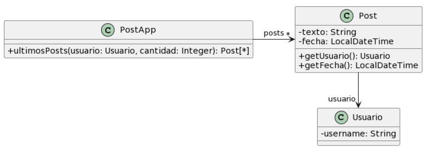

## Carrito de compras

### Pasos a seguir 
- 1) Detectar y nombrar los malos olores.
- 2) Extraer el código donde se encuentra el "code smells".
- 3) Determinar los refactoring que se van a utilizar.
- 4) Desarrollar el UML con la soución final.
- 5) Expongo el código correjido, con el refactoring aplicado.
- 6) Vuelvo al paso uno. Sino encuentro más code smells termino.

## 1.1 Protocolo de "PodtApp"



```java


```java

