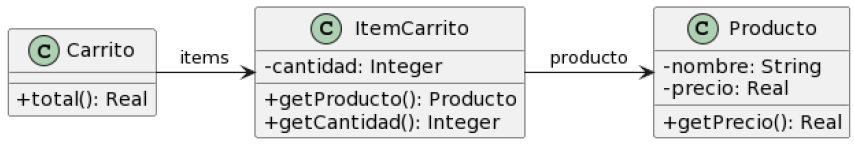

## Carrito de compras

### Pasos a seguir 
- 1) Detectar y nombrar los malos olores.
- 2) Extraer el código donde se encuentra el "code smells".
- 3) Determinar los refactoring que se van a utilizar.
- 4) Desarrollar el UML con la soución final.
- 5) Expongo el código correjido, con el refactoring aplicado.
- 6) Vuelvo al paso uno. Sino encuentro más code smells termino.

## Protocolo "Carrito de compras"



```java
public class Producto {
    private String nombre;
    private double precio;

    public double getPrecio() {
        return this.precio;
    }
}

public class ItemCarrito {
    private Producto producto;
    private int cantidad;

    public Producto getProducto() {
        return this.producto;
    }

    public int getCantidad() {
        return this.cantidad;
    }
}

public class Carrito {
    private List<ItemCarrito> items;

    public double total() {
        return this.items.stream()
            .mapToDouble(item -> item.getProducto().getPrecio() * item.getCantidad())
            .sum();
    }
}

```
- 1) Detectar y nombrar los malos olores.
- Clase de datos
- Envidia de atributos "featute evid"

- 2) Extraer el código donde se encuentra el "code smells" y aplicamos el refactoring.
```java
public class Carrito {
	private List<ItemCarrito> items;

    public double total() {
            return this.items.stream().mapToDouble(item -> item.getProducto().getPrecio() * item.getCantidad()).sum();
    }///////////////////////////original se aplica extracción///////////////////////////////

    public double total() {
            return this.items.stream().mapToDouble(item -> calcularTotalItem(item)).sum();
    }
    private double calcularTotalItem(ItemCarrito item) {
            return item.getProducto().getPrecio() * item.getCantidad();
    }
}
```
- UML


- 2) aplicamos move metod
```java
public class Carrito {
	private List<ItemCarrito> items;

    public double total() {
            return this.items.stream().mapToDouble(item -> calcularTotalItem(item)).sum();
    }

public class ItemCarrito {
    private Producto producto;
    private int cantidad;
        
    public Producto getProducto() {
        return this.producto;
    }
    
    public int getCantidad() {
        return this.cantidad;
    }
    
    public double calcularTotal() {
    	return this.producto.getPrecio() * this.cantidad;
    }
}


```


