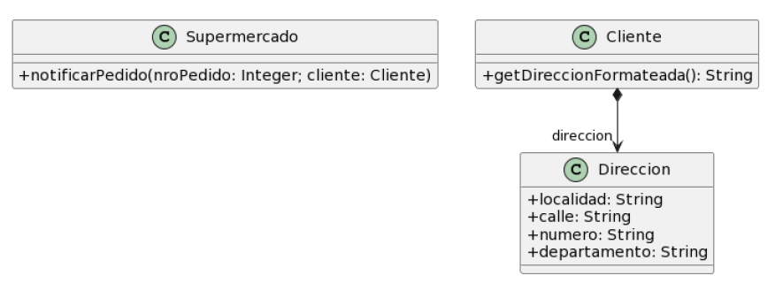

## ENVIO DE PEDIDOS

### Pasos a seguir 
- 1) Detectar y nombrar los malos olores.
- 2) Extraer el código donde se encuentra el "code smells".
- 3) Determinar los refactoring que se van a utilizar.
- 4) Desarrollar el UML con la soución final.
- 5) Expongo el código correjido, con el refactoring aplicado.
- 6) Vuelvo al paso uno. Sino encuentro más code smells termino.

## Protocolo "envio de pedidos



```java
public class Supermercado {

    public void notificarPedido(long nroPedido, Cliente cliente) {
        String notificacion = MessageFormat.format(“Estimado cliente, se le informa que hemos recibido su pedido con número {0}, el cual será enviado a la dirección {1}”, new Object[] { nroPedido, cliente.getDireccionFormateada() });
        // lo imprimimos en pantalla, podría ser un mail, SMS, etc..
        System.out.println(notificacion);
        }
}
public class Cliente {

    public String getDireccionFormateada() {
        return
            this.direccion.getLocalidad() + “, ” +
            this.direccion.getCalle() + “, ” +
            this.direccion.getNumero() + “, ” +
            this.direccion.getDepartamento();
}
```
- 1) Detectar y nombrar los malos olores.
- Clase datos "Data Class" 
- intimidad inapropiada "inappropiate intemacy " cuando una clase accede demaciado a los atributos o métodos de otra.En este caso Cliente con Dirección
- envidia de atributos 
- los atributos están como publicos

- 2) exlicar el refactoring que utilizaremos.
- Mover los campos "move field"
- poner los atributos publicos como privados. "Encapsular"
- Eliminamos la clase de datos.

- 3) UML


