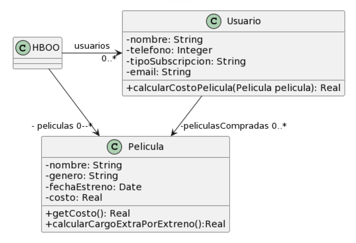
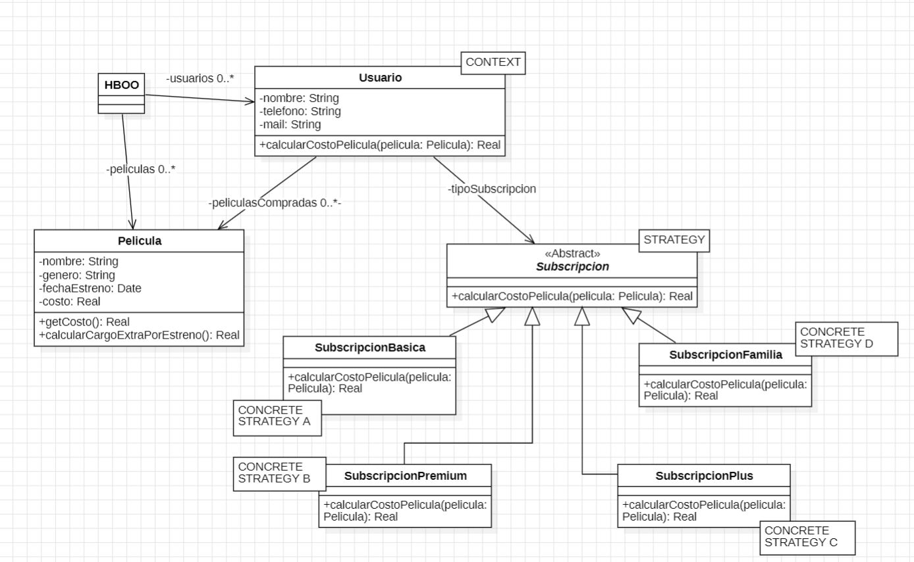

## 2.6 ENVIO DE PEDIDOS Adrian

### Pasos a seguir 
- 1) Detectar y nombrar los malos olores.
- 2) Extraer el código donde se encuentra el "code smells".
- 3) Determinar los refactoring que se van a utilizar.
- 4) Desarrollar el UML con la soución final.
- 5) Expongo el código correjido, con el refactoring aplicado.
- 6) Vuelvo al paso uno. Sino encuentro más code smells termino.

## Protocolo "envio de pedidos"



```java
import java.text.MessageFormat;

public class Usuario { 
    String tipoSubscripcion; 
    // ... 
 
    public void setTipoSubscripcion(String unTipo) { 
     this.tipoSubscripcion = unTipo; 
    } 
     
    public double calcularCostoPelicula(Pelicula pelicula) { 
     double costo = 0; 
     if (tipoSubscripcion=="Basico") { 
       costo = pelicula.getCosto() + pelicula.calcularCargoExtraPorEstreno(); 
     } 
     else if (tipoSubscripcion== "Familia") { 
       costo = (pelicula.getCosto() + pelicula.calcularCargoExtraPorEstreno()) * 0.90; 
     } 
     else if (tipoSubscripcion=="Plus") { 
       costo = pelicula.getCosto(); 
     } 
     else if (tipoSubscripcion=="Premium") { 
       costo = pelicula.getCosto() * 0.75; 
     } 
     return costo; 
    } 
} 
 
public class Pelicula { 
    LocalDate fechaEstreno; 
    // ... 
 
    public double getCosto() { 
     return this.costo; 
    } 
     
    public double calcularCargoExtraPorEstreno(){ 
// Si la Película se estrenó 30 días antes de la fecha actual, retorna un cargo de 0$, caso contrario, retorna un cargo extra de 300$
return (ChronoUnit.DAYS.between(this.fechaEstreno, LocalDate.now()) ) > 30 ? 0 : 300;
    }
}
```
### 1. Detectar y nombrar los malos olores Code Smells.
- envisia de atributos
- Métodos largos 
- presencia de condicionales."switch statement"

### 2. Remplace conditional whitch Strategy. Se creo la strategy Sibscripción como clase a  abstracta, y sus estrategias. 
- movemos los metodos que se encuntran dentro de usuario hacia las strateging.
- Dejamos un método en el contexo de la clase usuario, para poder configurar los estrategias.
- Dejamos otro método en el usuario para setar la estrategia.

### 3. UML de la solución



### 4. Expongo el código correjido, con el refactoring aplicado.

```java
public class Usuario {
	private Subscripcion tipoSubscripcion;
    // ...

	public void setTipoSubscripcion(Subscripcion unTipo) {
		this.tipoSubscripcion = unTipo;
	}

	public double calcularCostoPelicula(Pelicula pelicula) {
		return tipoSubscripcion.calcularCostoPelicula(pelicula);
	}
}

public abstract class Subscripcion {

	public abstract double calcularCostoPelicula(Pelicula pelicula);

}

public class SubscripcionBasica extends Subscripcion{
	
	public double calcularCostoPelicula(Pelicula pelicula) {
		return pelicula.getCosto() + pelicula.calcularCargoExtraPorEstreno();
	}

}

public class SubscripcionFamilia extends Subscripcion{

	public double calcularCostoPelicula(Pelicula pelicula) {
		return (pelicula.getCosto() + pelicula.calcularCargoExtraPorEstreno()) * 0.90;
	}

}

public class SubscripcionPlus extends Subscripcion{

	public double calcularCostoPelicula(Pelicula pelicula) {
		return pelicula.getCosto();
	}

}

public class SubscripcionPremium extends Subscripcion{

	public double calcularCostoPelicula(Pelicula pelicula) {
		return pelicula.getCosto() * 0.75;
	}

}

public class Pelicula {
	private LocalDate fechaEstreno;
    // ...

	public double getCosto() {
		return this.costo;
	}

	public double calcularCargoExtraPorEstreno() {
		// Si la Película se estrenó 30 días antes de la fecha actual, retorna un cargo
		// de 0$, caso contrario, retorna un cargo extra de 300$
		return (ChronoUnit.DAYS.between(this.fechaEstreno, LocalDate.now())) > 30 ? 0 : 300;
	}
}```


