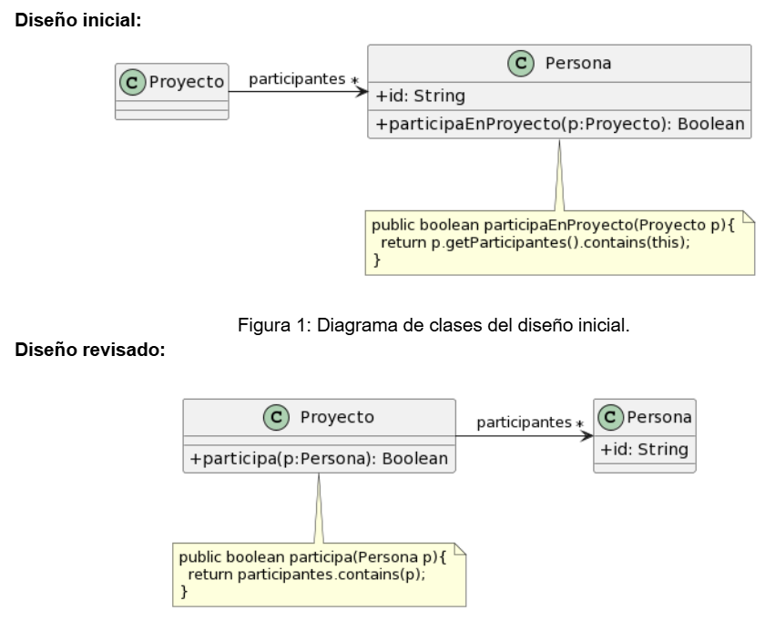

# Algo huele mal

## 1.1 Protocolo de Cliente
La clase Cliente tiene el siguiente protocolo. ¿Cómo puede mejorarlo? 


```java
* Retorna el límite de crédito del cliente
*/
public double lmtCrdt() {...

/** 
* Retorna el monto facturado al cliente desde la fecha f1 a la fecha f2
*/
protected double mtFcE(LocalDate f1, LocalDate f2) {...

/** 
* Retorna el monto cobrado al cliente desde la fecha f1 a la fecha f2
*/
private double mtCbE(LocalDate f1, LocalDate f2) {...
```

**Respuesta:**

*Code Smells*
- Los nombres de los métodos son pocos descriptivos, así mismo los nombres de las variables deben indicar su **rol** y los nombres de los **métodos** su intención.

Podrías reescribirse de la siguiente manera:

```java

public double limiteDeCredito(){...}

public double montoFacturado(LocalDate fechaInicio, LocalDate fechaFin){...}

public double montoCobrado(LocalDate fechaInicio, LocalDate fechaFin){...}
```

## 1.2 Participación en Proyectos

Al revisar el siguiente diseño inicial (Figura 1), se decidió realizar un cambio para evitar lo que se consideraba un mal olor. El diseño modificado se muestra en la Figura 2. Indique qué tipo de cambio se realizó y si lo considera apropiado. Justifique su respuesta.



### 1. Code Smells
- Feature Envy
- Data Class

### 2. Extracto del código que representa el mal olor

 ```java
 public class Persona {

public boolean participantesEnProyecto(Proyecto p){
        return p.getParticipantes().contains(this);
    }
 }
```
### 3. Determinar refactoring a utilizar

 Los cambios realizados los considero apropiados porque se le quita la responsabilidad a la clase *Persona* de saber si participa o no en el *Proyecto* y se la otorga a esta última, ya que sabe sus *participantes*.
Las métodos de refactoring usados en este ejercicio son **Extract Method**...

### 4. Diagrama con el diseño final

Se demuestra en figura 1.

### 5 Código con el refactoring aplicado

 ```java
 public class Proyecto {
    
public boolean participantesEnProyecto(Persona persona){
        return this.participantes.contains(persona);
    }
 }
```


## 1.3 Cálculos
Analice el código que se muestra a continuación. Indique qué code smells encuentra y cómo pueden corregirse.

```java

public void imprimirValores() {
	int totalEdades = 0;
	double promedioEdades = 0;
	double totalSalarios = 0;
	
	for (Empleado empleado : personal) {
		totalEdades = totalEdades + empleado.getEdad();
		totalSalarios = totalSalarios + empleado.getSalario();
	}
	promedioEdades = totalEdades / personal.size();
		
	String message = String.format("El promedio de las edades es %s y el total de salarios es %s", promedioEdades, totalSalarios);
	
	System.out.println(message);
}


```

### 1. Identificar los code smells
- Los nombres son pocos descriptivos. 
- Otro mal olor es el de *Large Method*, podría reescribirse.

### 2. Extracto del código con mal olor

```java

public void imprimirValores() {
	int totalEdades = 0;
	double promedioEdades = 0;
	double totalSalarios = 0;
	
	for (Empleado empleado : personal) {
		totalEdades = totalEdades + empleado.getEdad();
		totalSalarios = totalSalarios + empleado.getSalario();
	}
	promedioEdades = totalEdades / personal.size();
		
	String message = String.format("El promedio de las edades es %s y el total de salarios es %s", promedioEdades, totalSalarios);
	
	System.out.println(message);
}


```

### 3. Determinar el refactoring a aplicar 

- **Extract Method**, para modularizar la solución.
- **Replace Temp with Query**, quitamos las variables temporales con una consulta.

### 4. UML con la solución final

De momento, no dibujado.


### 5. Extracto del método con el refactoring aplicado

```java

public void imprimirPromedioEdadesYTotalSalario() {
    System.out.println("Promedio de edades: " + this.calcularPromedioEdades()
        + " | Total salarios: " + this.calcularTotalSalarios());
}

private double calcularPromedioEdades() {
    return this.personal.stream()
        .mapToDouble(persona -> persona.getEdad())
        .average()
        .orElse(0);
}

private double calcularTotalSalarios() {
    return this.personal.stream()
        .mapToDouble(persona -> persona.getSalario())
        .sum();
}
```
