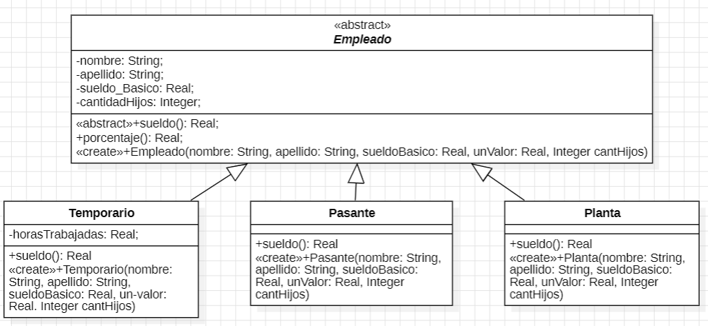

# Ejercicio 2
Para cada una de las siguientes situaciones, realice en forma iterativa los siguientes pasos:
- (i) indique el mal olor,
- (ii) indique el refactoring que lo corrige,
- (iii) aplique el refactoring, mostrando el resultado final (código y/o diseño según corresponda).
- Si vuelve a encontrar un mal olor, retorne al paso (i).
  
```java
public class EmpleadoTemporario {
    public String nombre;
    public String apellido;
    public double sueldoBasico = 0;
    public double horasTrabajadas = 0;
    public int cantidadHijos = 0;

    public double sueldo() {
        return this.sueldoBasico
            + (this.horasTrabajadas * 500)
            + (this.cantidadHijos * 1000)
            - (this.sueldoBasico * 0.13);
    }
}

public class EmpleadoPlanta {
    public String nombre;
    public String apellido;
    public double sueldoBasico = 0;
    public int cantidadHijos = 0;

    public double sueldo() {
        return this.sueldoBasico
            + (this.cantidadHijos * 2000)
            - (this.sueldoBasico * 0.13);
    }
}

public class EmpleadoPasante {
    public String nombre;
    public String apellido;
    public double sueldoBasico = 0;

    public double sueldo() {
        return this.sueldoBasico - (this.sueldoBasico * 0.13);
    }
}

```

# 2.1 Empleados

### 1. Code Smells 
- Duplicate Code.
- Public Fields.

### 2. Extracto del código que representa el mal olor

```java
public class EmpleadoTemporario {
    public String nombre;
    public String apellido;
    public double sueldoBasico = 0;
    public double horasTrabajadas = 0;
    public int cantidadHijos = 0;

    public double sueldo() {
        return this.sueldoBasico
            + (this.horasTrabajadas * 500)
            + (this.cantidadHijos * 1000)
            - (this.sueldoBasico * 0.13);
    }
}
```

### 3. Determinar el refactoring a aplicar que resuelve el code smell

- Extract Class, ya que se repiten código y atributos, generamos una jerarquía. (*Duda: ¿Deberíamos aplicar Pull Up Method, o Template Method?*).
- Encapsulate Field, pasamos los atributos a privados.
  
### 4. Diseño de UML - Solución final



### 5. Código corregido

- [Empleado](./UMLyArchivos/Empleado.java)
- [Pasante](./UMLyArchivos/Pasante.java)
- [Planta](./UMLyArchivos/Planta.java)
- [Permanente](./UMLyArchivos/Permanente.java)
- [Temporario](./UMLyArchivos/Temporario.java)

## 2.2
