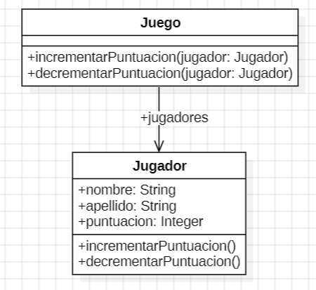

# 2.2 Juegos

```java

public class Juego {
    // Métodos para modificar la puntuación de un jugador
    public void incrementar(Jugador j) {
        j.puntuacion = j.puntuacion + 100;
    }

    public void decrementar(Jugador j) {
        j.puntuacion = j.puntuacion - 50;
    }

    // Clase anidada Jugador
    public class Jugador {
        public String nombre;
        public String apellido;
        public int puntuacion = 0;
    }
}
```

### 1. Code Smells
- Public Field, atributos públicos.
- Nombre de los métodos pocos descriptivos.
- Feature Envy por parte de la clase juego.
  
### 2. Extracto del código con el code smell

```java

public class Juego {
    // Métodos para modificar la puntuación de un jugador
    public void incrementar(Jugador j) {
        j.puntuacion = j.puntuacion + 100;
    }

    public void decrementar(Jugador j) {
        j.puntuacion = j.puntuacion - 50;
    }

    // Clase anidada Jugador
    public class Jugador {
        public String nombre;
        public String apellido;
        public int puntuacion = 0;
    }
}
```

### 3. Determinar los refactorings que se van a utilizar
- Encapsulate Field, solucionar los atributos públicos.
- Rename Method, corregir los nombres pocos descriptivos.
- Move Method, mover los métodos a la clase de jugador.

### 4. UML de la solucion final


### 5. Código con el refactoring aplicado

```java
public class Juego {
    // Métodos para modificar la puntuación de un jugador
    public void incrementarPuntuacion(Jugador unJugador) {
        unJugador.incrementarPuntuacion();
    }

    public void decrementarPuntuacion(Jugador unJugador) {
        unJugador.decrementarPuntuacion();
    }
}
    // Clase anidada Jugador
public class Jugador {
        public String nombre;
        public String apellido;
        public int puntuacion = 0;

        public void incrementarPuntuacion(){
            this.puntuacion += 100;
        }

        public void decrementarPuntuacion(){
            this.puntuacion -= 50;
        }
}

```
