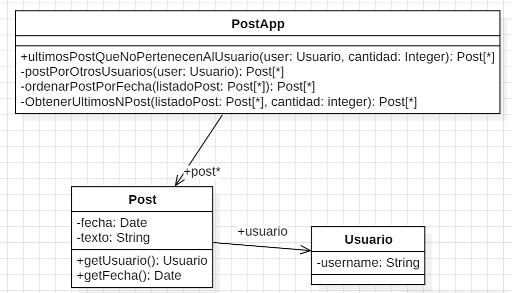

## 2.3 Publicaciones


```java
/** 
 * Retorna los últimos N posts que no pertenecen al usuario user 
 */ 
public List<Post> ultimosPosts(Usuario user, int cantidad) { 
    List<Post> postsOtrosUsuarios = new ArrayList<Post>(); 
    for (Post post : this.posts) { 
        if (!post.getUsuario().equals(user)) { 
            postsOtrosUsuarios.add(post); 
        } 
    } 
         
    // Ordena los posts por fecha 
    for (int i = 0; i < postsOtrosUsuarios.size(); i++) { 
        int masNuevo = i; 
        for (int j = i + 1; j < postsOtrosUsuarios.size(); j++) { 
            if (postsOtrosUsuarios.get(j).getFecha().isAfter(postsOtrosUsuarios.get(masNuevo).getFecha())) { 
                masNuevo = j; 
            }     
        } 
        Post unPost = postsOtrosUsuarios.set(i, postsOtrosUsuarios.get(masNuevo)); 
        postsOtrosUsuarios.set(masNuevo, unPost);     
    } 
         
    List<Post> ultimosPosts = new ArrayList<Post>(); 
    int index = 0; 
    Iterator<Post> postIterator = postsOtrosUsuarios.iterator(); 
    while (postIterator.hasNext() && index < cantidad) { 
        ultimosPosts.add(postIterator.next()); 
    } 
    return ultimosPosts; 
}
```

---

### 1. Code Smells identificados

* **Large Method**: el método realiza múltiples tareas sin separación clara.
* **Nombres poco descriptivos**: los métodos no reflejan claramente su propósito.
* **Reinventar la rueda**: se implementa una lógica de ordenamiento manual en lugar de utilizar las herramientas del lenguaje (Streams, `Comparator`, etc.).

---

### 2. Extracto del código con mal olor

Todo el código listado arriba.

---

### 3. Refactorings a utilizar

* **Rename Method**: para mejorar la claridad del nombre del método.
* **Extract Method**: separar responsabilidades en métodos auxiliares.
* **Move Method** (opcional, si se decide reubicar lógica).
* **Replace Loop With Pipeline**: usar Streams en lugar de bucles imperativos.

---

### 4. Diseño UML



---

### 5. Código con el refactoring aplicado

```java
/** 
 * Retorna los últimos N posts que no pertenecen al usuario user 
 */ 
public List<Post> ultimosPostsQueNoPertenecenAlUsuario(Usuario user, int cantidad) { 
    List<Post> postsOtrosUsuarios = this.postsPorOtrosUsuarios(user);
    postsOtrosUsuarios = this.ordenarPostsPorFecha(postsOtrosUsuarios);
    return obtenerUltimosNPosts(postsOtrosUsuarios, cantidad);
}

private List<Post> postsPorOtrosUsuarios(Usuario user) {
    // Filtramos los posts que NO son del usuario
    return this.posts.stream()
        .filter(post -> !post.getUsuario().equals(user))
        .collect(Collectors.toList());
}

private List<Post> ordenarPostsPorFecha(List<Post> listadoPosts) {
    // Ordenamos por fecha descendente
    return listadoPosts.stream()
        .sorted((p1, p2) -> p2.getFecha().compareTo(p1.getFecha()))
        .collect(Collectors.toList());
}

private List<Post> obtenerUltimosNPosts(List<Post> listadoPosts, int cantidad) {
    // Tomamos los primeros N posts
    return listadoPosts.stream()
        .limit(cantidad)
        .collect(Collectors.toList());
}
```

