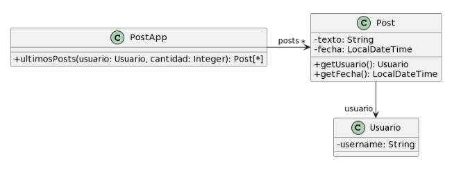

# 2.3 Publicaciones



```java
/** 
* Retorna los últimos N posts que no pertenecen al usuario user 
*/ 
public List<Post> ultimosPosts(Usuario user, int cantidad) { 
         
    List<Post> postsOtrosUsuarios = new ArrayList<Post>(); 
    for (Post post : this.posts) { 
        if (!post.getUsuario().equals(user)) { 
            postsOtrosUsuarios.add(post); 
        } 
    } 
         
   // ordena los posts por fecha 
   for (int i = 0; i < postsOtrosUsuarios.size(); i++) { 
       int masNuevo = i; 
       for(int j= i +1; j < postsOtrosUsuarios.size(); j++) { 
           if (postsOtrosUsuarios.get(j).getFecha().isAfter( 
     postsOtrosUsuarios.get(masNuevo).getFecha())) { 
              masNuevo = j; 
           }     
       } 
      Post unPost = postsOtrosUsuarios.set(i,postsOtrosUsuarios.get(masNuevo)); 
      postsOtrosUsuarios.set(masNuevo, unPost);     
   } 
         
    List<Post> ultimosPosts = new ArrayList<Post>(); 
    int index = 0; 
    Iterator<Post> postIterator = postsOtrosUsuarios.iterator(); 
    while (postIterator.hasNext() &&  index < cantidad) { 
        ultimosPosts.add(postIterator.next()); 
    } 
    return ultimosPosts; 
} 

```

### 1. Reconocer los Code Smells
- Large Method.
- Métodos pocos descriptivos.
- Reinventar la rueda, ya que no se utilizan las herramientas provistas por el lenguaje.

### 2. Extracto del código con el mal olor
Todo el que se muestra arriba.

### 3. Refactoring a utilizar
- Rename Method
- Extract Method
- Move Method
- Replace Loop With Pipeline

### 4. Diseño UML

### 5. Código con el refactoring aplicado

```java
/** 
* Retorna los últimos N posts que no pertenecen al usuario user 
*/ 
public List<Post> ultimosPostsQueNoPertenecenAlUsuario(Usuario user, int cantidad) { 
         
    List<Post> postsOtrosUsuarios = this.postPorOtrosUsuarios(user);
    postPorOtrosUsuarios = this.ordenarPostPorFecha(postPorOtrosUsuarios);
    return obtenerUltimosNPost(postPorOtrosUsuarios, cantidad);
}

}
         
   // ordena los posts por fecha 
   for (int i = 0; i < postsOtrosUsuarios.size(); i++) { 
       int masNuevo = i; 
       for(int j= i +1; j < postsOtrosUsuarios.size(); j++) { 
           if (postsOtrosUsuarios.get(j).getFecha().isAfter( 
     postsOtrosUsuarios.get(masNuevo).getFecha())) { 
              masNuevo = j; 
           }     
       } 
      Post unPost = postsOtrosUsuarios.set(i,postsOtrosUsuarios.get(masNuevo)); 
      postsOtrosUsuarios.set(masNuevo, unPost);     
   } 
         
    List<Post> ultimosPosts = new ArrayList<Post>(); 
    int index = 0; 
    Iterator<Post> postIterator = postsOtrosUsuarios.iterator(); 
    while (postIterator.hasNext() &&  index < cantidad) { 
        ultimosPosts.add(postIterator.next()); 
    } 
    return ultimosPosts; 
} 

```