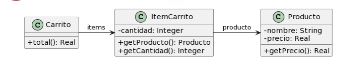
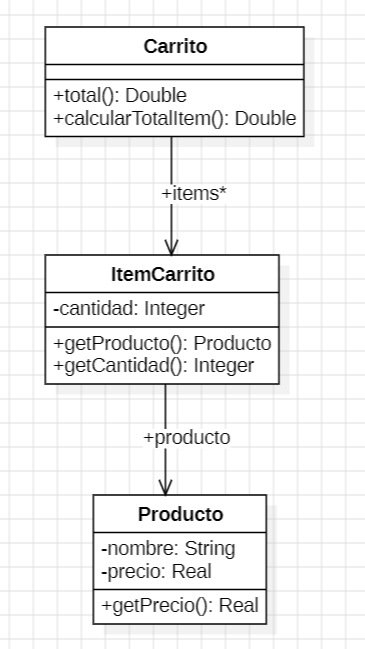
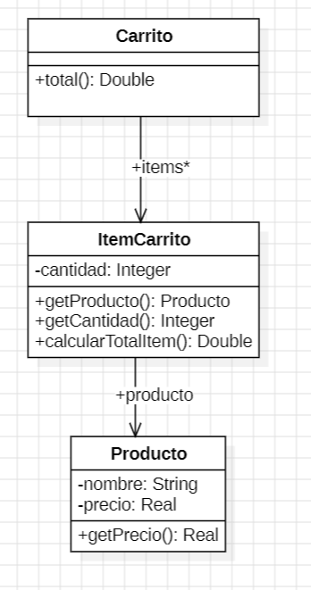

## 2.4 Carrito de Compras



```java
public class Producto {
    private String nombre;
    private double precio;

    public double getPrecio() {
        return this.precio;
    }
}

public class ItemCarrito {
    private Producto producto;
    private int cantidad;

    public Producto getProducto() {
        return this.producto;
    }

    public int getCantidad() {
        return this.cantidad;
    }
}

public class Carrito {
    private List<ItemCarrito> items;

    public double total() {
        return this.items.stream()
            .mapToDouble(item -> item.getProducto().getPrecio() * item.getCantidad())
            .sum();
    }
}
```

---

### 1. Code Smells identificados

* **Feature Envy** (envidia de atributos): el cálculo del precio total lo realiza `Carrito`, pero debería ser responsabilidad de `ItemCarrito`.
* **Data Class**: `ItemCarrito` se comporta como una simple estructura de datos sin lógica propia.

---

### 2. Refactorings a utilizar

* **Extract Method**: extraer el cálculo en un método propio.
* **Move Method**: mover el método `calcularTotalItem()` a la clase `ItemCarrito`.

---

### 3. Resultado

---

#### 🧩 1. Extract Method



```java
public class Carrito {
    private List<ItemCarrito> items;

    public double total() {
        return this.items.stream().mapToDouble(item -> calcularTotalItem(item)).sum();
    }

    public double calcularTotalItem(ItemCarrito item) {
        return item.getProducto().getPrecio() * item.getCantidad();
    }
}
```

---

#### 🔄 2. Move Method



```java
public class Producto {
    private String nombre;
    private double precio;

    public double getPrecio() {
        return this.precio;
    }
}

public class ItemCarrito {
    private Producto producto;
    private int cantidad;

    public double calcularTotalItem() {
        return this.producto.getPrecio() * this.cantidad;
    }

    public Producto getProducto() {
        return this.producto;
    }

    public int getCantidad() {
        return this.cantidad;
    }
}

public class Carrito {
    private List<ItemCarrito> items;

    public double total() {
        return this.items.stream().mapToDouble(ItemCarrito::calcularTotalItem).sum();
    }
}
```
