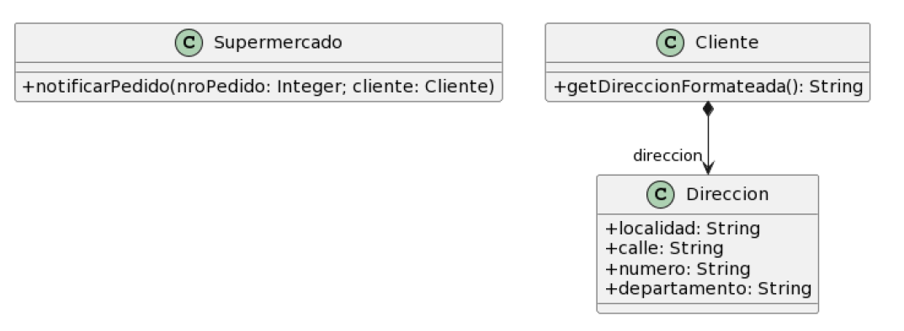
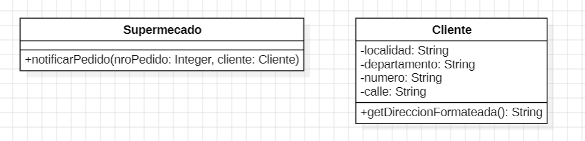

## 2.5 Envío de Pedidos



```java
import java.text.MessageFormat;

public class Supermercado {
    public void notificarPedido(long nroPedido, Cliente cliente) {
        String notificacion = MessageFormat.format(
            "Estimado cliente, se le informa que hemos recibido su pedido con número {0}, el cual será enviado a la dirección {1}",
            new Object[] { nroPedido, cliente.getDireccionFormateada() }
        );
        // Lo imprimimos en pantalla. Podría ser un mail, SMS, etc.
        System.out.println(notificacion);
    }
}

public class Cliente {
    private Direccion direccion;

    public String getDireccionFormateada() {
        return this.direccion.getLocalidad() + ", " +
               this.direccion.getCalle() + ", " +
               this.direccion.getNumero() + ", " +
               this.direccion.getDepartamento();
    }
}
```

---

### 1. Code Smells identificados

* **Data Class** en la clase `Direccion`.
* **Feature Envy** (envidia de atributos) en la clase `Cliente`.
* **Inappropriate Intimacy** (intimidad inapropiada): una clase accede demasiado a los detalles internos de otra (en este caso, `Cliente` accede a los atributos de `Direccion`).
* **Atributos públicos** o demasiado expuestos.

---

### 2. Refactorings a utilizar

* **Move Field**: mover los atributos que son más utilizados en `Cliente` directamente a esa clase.
* **Encapsulate Field**: encapsular los atributos para mantener el principio de ocultamiento.

---

### 3. Resultado



```java
import java.text.MessageFormat;

public class Supermercado {
    public void notificarPedido(long nroPedido, Cliente cliente) {
        String notificacion = MessageFormat.format(
            "Estimado cliente, se le informa que hemos recibido su pedido con número {0}, el cual será enviado a la dirección {1}",
            new Object[] { nroPedido, cliente.getDireccionFormateada() }
        );
        // Lo imprimimos en pantalla. Podría ser un mail, SMS, etc.
        System.out.println(notificacion);
    }
}

public class Cliente {
    private String localidad;
    private String calle;
    private String numero;
    private String departamento;

    public String getDireccionFormateada() {
        return this.localidad + ", " + this.calle + ", " + this.numero + ", " + this.departamento;
    }
}
```

