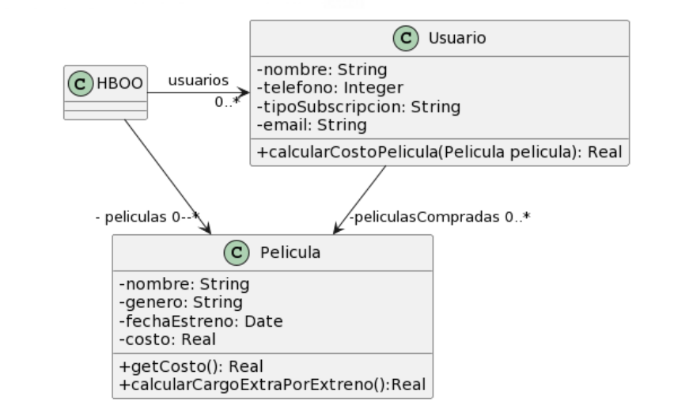

## 2.1 Películas



```java
public class Usuario {
    String tipoSubscripcion;
    // ...

    public void setTipoSubscripcion(String unTipo) {
        this.tipoSubscripcion = unTipo;
    }

    public double calcularCostoPelicula(Pelicula pelicula) {
        double costo = 0;
        if (tipoSubscripcion == "Basico") {
            costo = pelicula.getCosto() + pelicula.calcularCargoExtraPorEstreno();
        }
        else if (tipoSubscripcion == "Familia") {
            costo = (pelicula.getCosto() + pelicula.calcularCargoExtraPorEstreno()) * 0.90;
        }
        else if (tipoSubscripcion == "Plus") {
            costo = pelicula.getCosto();
        }
        else if (tipoSubscripcion == "Premium") {
            costo = pelicula.getCosto() * 0.75;
        }
        return costo;
    }
}

public class Pelicula {
    LocalDate fechaEstreno;
    // ...

    public double getCosto() {
        return this.costo;
    }

    public double calcularCargoExtraPorEstreno() {
        // Si la película se estrenó 30 días antes de la fecha actual, retorna un cargo de $0;
        // caso contrario, retorna un cargo extra de $300.
        return (ChronoUnit.DAYS.between(this.fechaEstreno, LocalDate.now())) > 30 ? 0 : 300;
    }
}
```

---

### 1. Code Smells identificados

* **Método largo**: el método `calcularCostoPelicula()` realiza múltiples tareas.
* **Presencia de condicionales**: el comportamiento varía según el tipo de suscripción, lo cual complica el mantenimiento.

---

### 2. Refactorings a utilizar

* **Replace Conditional with Strategy**: se crea la clase abstracta `Subscripcion` con sus respectivas estrategias (`SubscripcionBasica`, `Familiar`, `Premium` y `Plus`).
* **Move Method**: se trasladan los cálculos desde el método en `Usuario` hacia las clases estrategia.
* Se deja un método en el contexto (clase `Usuario`) para configurar la estrategia.
* Se deja otro método en el contexto para delegar el cálculo del costo.

---

### 3. Resultado


```java
public class Usuario {
    private Subscripcion tipoSubscripcion;
    private ArrayList<Pelicula> peliculasCompradas;

    public void setTipoSubscripcion(Subscripcion unTipo) {
        this.tipoSubscripcion = unTipo;
    }

    public double calcularCostoPelicula(Pelicula pelicula) {
        return this.tipoSubscripcion.calcularCostoPelicula(pelicula);
    }
}

public class Pelicula {
    LocalDate fechaEstreno;
    // ...

    public double getCosto() {
        return this.costo;
    }

    public double calcularCargoExtraPorEstreno() {
        // Si la película se estrenó 30 días antes de la fecha actual, retorna un cargo de $0;
        // caso contrario, retorna un cargo extra de $300.
        return (ChronoUnit.DAYS.between(this.fechaEstreno, LocalDate.now())) > 30 ? 0 : 300;
    }
}

public abstract class Subscripcion {
    abstract double calcularCostoPelicula(Pelicula unaPelicula);
}

public class SubscripcionBasica extends Subscripcion {
    public double calcularCostoPelicula(Pelicula pelicula) {
        return pelicula.getCosto() + pelicula.calcularCargoExtraPorEstreno();
    }
}

public class SubscripcionFamilia extends Subscripcion {
    public double calcularCostoPelicula(Pelicula pelicula) {
        return (pelicula.getCosto() + pelicula.calcularCargoExtraPorEstreno()) * 0.90;
    }
}

public class SubscripcionPlus extends Subscripcion {
    public double calcularCostoPelicula(Pelicula pelicula) {
        return pelicula.getCosto();
    }
}

public class SubscripcionPremium extends Subscripcion {
    public double calcularCostoPelicula(Pelicula pelicula) {
        return pelicula.getCosto() * 0.75;
    }
}
```

